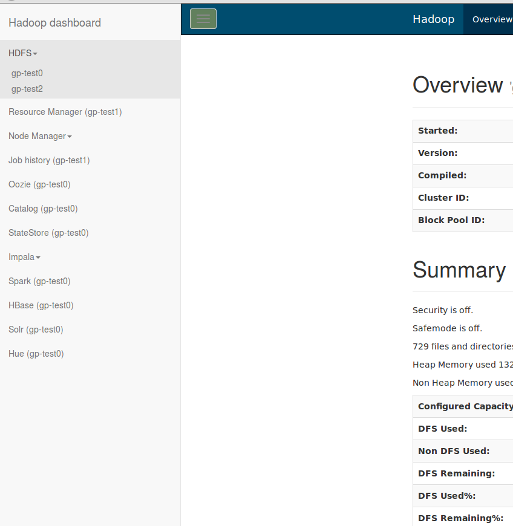

# Ansible Playbook: cloudera-hadoop

An ansible playbook to deploy cloudera hadoop components to the cluster
# Overview
The playbook is composed according to [official cloudera guides](http://www.cloudera.com/content/www/en-us/documentation/enterprise/5-4-x/topics/cdh_ig_command_line.html) with a primary purpose of production deployment in mind. High availability for **HDFS** and **Yarn** is implemented when sufficient number of resources(hosts) is configured. From the other side, all of the components can be also deployed on a single host.

# Description
#### The playbook is able to setup the required services for components:
* **hadoop hdfs**
* **hadoop yarn mapreduce**
* **zookeeper**
* **hive**
* **hbase**
* **impala**
* **solr**
* **spark**
* **oozie**
* **kafka**
* **hue**
* **postgresql**

The configuration is _very_ simple:

It’s only required to place hostname(s) to the appropriate group in [hosts](hosts) file, and the required services will be setup.

The playbook contain all configuration files in roles directories. If you need to add or change any parameter you can edit
the required configuration file which can be found in roles/_service_/[files|templates] directory.

The playbook run configuration check tasks at start, and will stop if the configuration is not supported,
providing a descriptive error message.

Besides of cluster( or single host ) setup, the playbook also generates cluster manager configuration file located at workdir/services.xml.
Please visit [clinit manager home page](https://github.com/sergevs/clinit) and see [manual](https://github.com/sergevs/clinit/wiki) .
The rpm package can be downloaded from [clinit-1.0-ssv1.el6.noarch.rpm](https://github.com/sergevs/clinit/releases/download/1.0/clinit-1.0-ssv1.el6.noarch.rpm).
After clinit package installed you’ll be able to stop, start and see status of services on any node.

# Configuration
Service configuration performed using the hosts file. The empty [hosts](https://github.com/sergevs/ansible-cloudera-hadoop/blob/master/hosts) file is supplied with playbook. **You must not remove any existing group**. Leave the group empty if you don't need services the group configures. The same hostname can be placed to any hosts group. As an instance if you want setup everything on one host, just put the same hostname to each hosts group.

#### Hosts file groups description:
* **[namenodes]** : configures _namenode_ services, at least 1 host is required, 2 hosts are allowed. HA HDFS with automatic namenode failover will be configured in the case of 2 hosts configured.
* **[datanodes]** : configures _datanode_ services, at least 1 host is required.
* **[yarnresourcemanager]** : configures _mapreduce_ yarn resource manager, at least 1 host is required. HA with automatic resource manager failover will be configured in the case more than 1 host provided. job history server will be configured on the 1st host in the group.  _node manager_ services will be configured on **[datanodes]** hosts.
* **[zookeepernodes]** : confiugures _zookeeper_ services. 3 or 5 hosts is required for HA in the case 2 **[namenodes]** hosts configured.
* **[journalnodes]** : configures _journalnode_ services required for HA configuration, at least one host is required in the case 2 **[namenodes]** hosts configured.
* **[postgresql]** : configures _postgresql_ server. the server provides a database storage required for other services( see below ). 1 host is allowed.
* **[hivemetastore]** : configures _hive metastore_ and _hiveserver2_ services. 1 host is allowed. **[postgresql]** host is required for metadata storage.
* **[impala-store-catalog]**: configures _impala-catalog_ and _impala-state-store_ services. 1 host is allowed. _impala-server_ will be configured on each **[datanodes]** host. **[hivemetastore]** host is required for metadata storage.
* **[hbasemaster]**: configures _hbase-master_ services. 1 host is allowed. _hbase-regionserver_ will be configured on on each **[datanodes]** host. at least 1 **[zookeepernodes]** host is required.
* **[solr]**: configures _solr_ service. at least 1 **[zookeepernodes]** host is required.
* **[spark]**: configures hosts to submit _spark_ jobs. _spark history server_ will be configured on the first host in the group.
* **[oozie]**: configures _oozie_ service. **[postgresql]** host is required for data storage.
* **[kafka]**: configures _kafka-server_ service. at least 1 **[zookeepernodes]** host is required.
* **[hue]**: configures _hue_ services. **[oozie]** host is required to submit jobs. **[postgresql]** is required for data storage.
* **[dashboard]**: places a simple static dashboard with links to all other services on mentioned hosts. See [dashboard](#dashboard) below.

#### Variables parameters:
Please see [group_vars](https://github.com/sergevs/ansible-cloudera-hadoop/tree/master/group_vars)

# Usage
To start deployment run:

    ansible-playbook -i hosts site.yaml

if you have installed clinit you can also run:

    clinit -S workdir/services.xml status
    clinit -S workdir/services.xml tree

To deploy configuration on existing cluster:

    ansible-playbook -i hosts --skip-tags=init,postgresql site.yaml

#### Tags used in playbook:
* **package** : install rpm packages
* **init** : clean up and initialize data
* **config** : deploy configuration files, useful if you want just change configuration on hosts.
* **test** : run test actions
* **check** : check hosts configuration

Also most hostgroups have the tag with similar name.

#### Monitoring
Playbook optionaly provides syslog-ng configuration and snmp-subagent configuration.

To use syslog-ng:

* set variable **enable_syslog**  to true;
* set variable **syslog_ng_destination** to existing syslog-ng destination(default value is **d_logcollector_throttled**).

To use snmp set **enable_snmp** to true and put following packages to repository:

* [net-snmp-subagent-shell](https://github.com/sergevs/net-snmp-subagent-shell)
* [hadoop-monitoring-utility](https://github.com/go1dshtein/hadoop-monitoring-utility)

# Dashboard


The dashboard consists of 5 static files and is placed into ```/var/html/dashboard``` by default.
Most of services should be available in a frame on the right. But Solr and some others set X-Frame-Options header
which denies embedding them into an iframe. If a service opens a white page for you - try opening it in a new tab with middle mouse button.

# Requirements
[Ansible 1.9.4](http://www.ansible.com) is required. Please read [official documentation](http://docs.ansible.com/ansible/intro_installation.html#latest-release-via-yum) to install it. Please note that Ansible 2.0 has introduced incompatible and undocumented changes which is not supported by the playbook at the time being, so please strictly follow the provided (official) documentation links.

OS version: Redhat/CentOS 6, 7

Cloudera Hadoop version: 5.4 - 5.7

The required for Cloudera Hadoop repositories have to be properly configured on the target hosts.
See also [official documentation](http://www.cloudera.com/content/www/en-us/documentation/enterprise/latest/topics/cdh_ig_yumrepo_local_create.html)

Java package(s) have to be available in the repository. You can download [jdk-8u65-linux-x64.rpm](http://www.oracle.com/technetwork/java/javase/downloads/java-archive-javase8-2177648.html#jdk-8u60-oth-JPR) from official oracle site

SSH key passwordless authentication must be configured for root account for all target hosts.

**se_linux** must be disabled

**remote_user = root** must be configured for ansible.

## License

[MIT](https://github.com/sergevs/ansible-cloudera-hadoop/blob/master/LICENSE)
